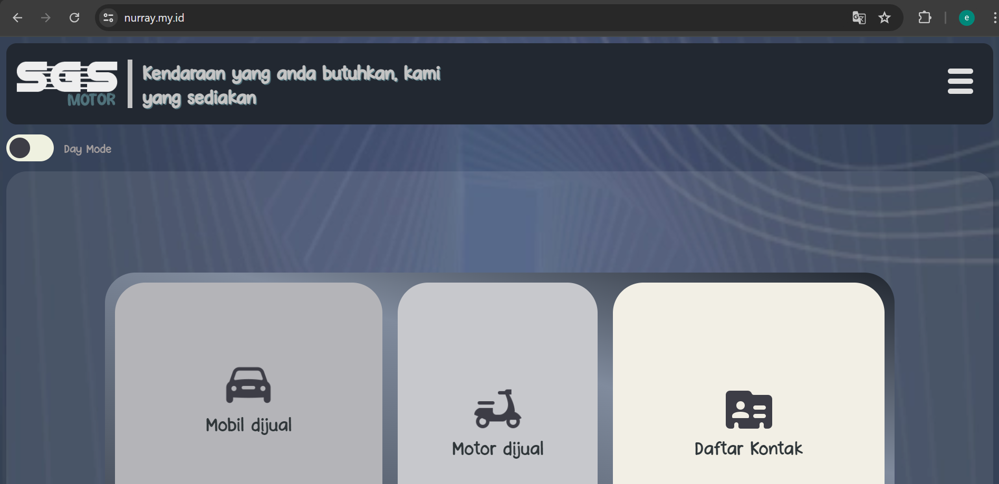
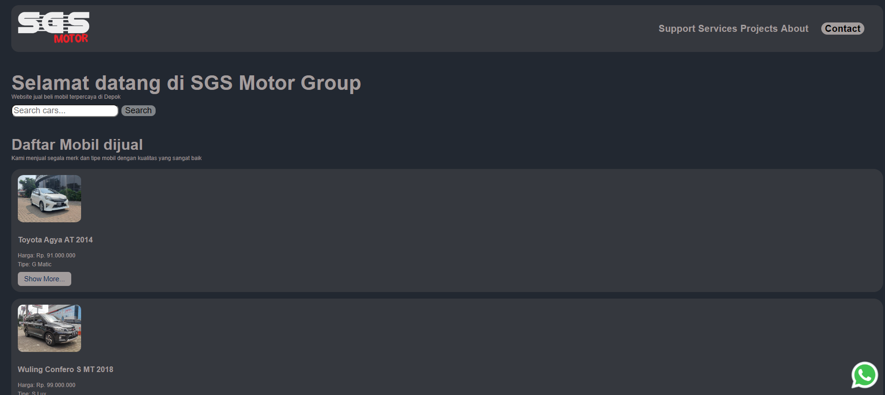

# Documentation


# NurrayMotor
Car buying and selling website that can serve all Indonesian people

# Description
NurrayMotor is a car buying and selling website designed to simplify the process of finding your dream car. We aim to provide a seamless experience for customers in their quest for the perfect vehicle.- **Visit our website** [nurray.my.id](https://nurray.my.id)



You can now contact us by whatsapp!


Feel the responsive web design, it is easy to use


# Usage
The use of this website is for car seekers to find their dream car to buy. Apart from that, car seekers can also create special posts to search for cars

# Deployment Process

1. Push the project to GitHub

push the project using gitbash commands, first `git status` for checking the status for each file. secondly add files to be commited with `git add <file directory>`, then commit the change using `git commit -m '<the commit note>'`. finally the project can be pushed to [GitHub](https://github.com) using `git push` command.
<br><br><br>
2. Checking the [GitHub](https://github.com) repository

After `git push` it can be checked in the [GitHub](https://github.com) repository.
<br><br><br>
3. Looking for new domain to be paid

Make sure your request domain is eligible to be bought, in this case I choose [Niagahoster](https://www.niagahoster.co.id/) as a domain provider.
<br><br><br>
4. Copy DNS Nameserver

Copy DNS/Nameserver from your domain provider.
<br><br><br>
5. Paste DNS Nameserver

Paste it on build tools and continous deployment webpage. In this case I used [Netlify](https://netlify.app)
<br><br><br>
6. Check your new domain

Load your new webpage to the browser, check if your new domain can load your project. Then your project completely deployed.
<br><br><br>
7. Make sure your domain is secured

When you add a custom domain on Netlify, it will be automatically secured by [LetsEncrypt](https://letsencrypt.org/). you can check it in Domain Management on Netlify.
<br><br><br>

```javascript
var s = "JavaScript syntax highlighting";
alert(s);
```
# Support

- **Email:** [farros.hr@gmail.com](mailto:farros.hr@gmail.com)

# Roadmap
- [x] Create a more user-friendly interface
- [x] Implement a more efficient search algorithm
- [ ] Develop a chatbot to help users with their queries

_____
_____
**For more details and updates, follow us on our social media platforms!**

<br><br><br><br><br><br><br><br>
_____
_____


# Farros - Software Engineer

## Introduction
Welcome to my GitHub profile! I'm Farros, a passionate software engineer. This README provides an overview of my projects, skills, and interests in the field of software engineering.

## About Me


- **Name:** Farros H R
- **Location:** [Yogyakarta, Indonesia](https://maps.app.goo.gl/ZwMCvT9GLL3xjPG17)
- **LinkedIn:** [Linkedin, Farros](https://www.linkedin.com/in/farros/)
- **Email:** [farros.hr@gmail.com](mailto:farros.hr@gmail.com)


   [](https://discord.gg/farroshayray) [](https://www.instagram.com/farroshayray/) [](https://www.facebook.com/farros.h.rayhan/) [](https://twitter.com/farroshayray) [](https://www.linkedin.com/in/farros/)
## Skills
- Programming Languages: Java, Python, JavaScript, C++
- Web Development: HTML, CSS, React, React JS
- Database Management: MySQL
- Version Control: Git
- Problem-solving and analytical skills
- Strong communication and teamwork abilities

## Projects
### Project 1: Car buying and selling website
- **Description:** A full-stack web application developed using `React`.
- **Features:** product listing, shopping cart, order processing, direct whatsapp chat.
- **Technologies:** `React`, `HTML/CSS`.
- **Repository:** [NurrayMotor](https://github.com/farroshayray/SGSmotor)
<br>
[](https://app.netlify.com/sites/nurray/deploys)
<br><br><br>

### Project 2: Surveilance detection system
- **Description:** A full-stack web application developed using `React`, `IoT`, and `Python`.
- **Features:** direct chat telegram, email, and whatsapp. Camera an infrared detection system
- **Technologies:** `IoT`, image processing, raspberry, and arduino
- **Repository:** [raspisurveilance](https://www.raspimotion.com)

## Interests
I am passionate about exploring new technologies and techniques in software engineering. I enjoy working on challenging projects that allow me to apply and expand my skills. Working remotely makes it easier for me to provide innovative solutions

## Contact Me
Feel free to reach out to me via [email](mailto:farros.hr@gmail.com) or connect with me on [LinkedIn](https://www.linkedin.com/in/farros/). I'm always open to discussing collaboration opportunities or just chatting about software engineering!
